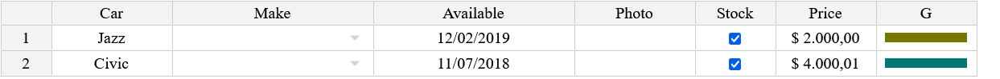

# Jspreadsheet CE v5: The JavaScript spreadsheet

<b>Jexcel CE</b> has been renamed to <b>Jspreadsheet CE</b><br><br>

## Jspreadsheet CE Use Cases

Jspreadsheet CE is an extensible framework for building sophisticated data-oriented interfaces with Excel-like controls. By bringing familiar spreadsheet features to your application, you can drastically reduce development time while delivering an interface that users already know how to use, leading to faster adoption and increased productivity. You can use Jspreadsheet in many different applications, such as:

- An editable data grid-based interface to simplify inventory management and production planning in a manufacturing company's ERP system.
- At an educational institution, Jspreadsheet powers grade management systems where teachers can efficiently import and modify student data.
- A logistics company uses Jspreadsheet to create dynamic delivery route planning tables with real-time updates.
- In a research laboratory, scientists use Jspreadsheet to collect and analyze experimental data with custom validation rules.
- At a retail chain, managers use Spreadsheet-based tools to coordinate staff schedules across multiple locations.


### Jspreadsheet Pro - Enterprise Solution
- [Jspreadsheet Pro](https://jspreadsheet.com/)
- [Real-time React Spreadsheets](https://github.com/jspreadsheet/spreadsheet-react-server)


## Overview

### Why Choose Jspreadsheet CE?

- Create rich, interactive data grid interfaces
- Handle complex data inputs with Excel-like functionality
- Direct Excel compatibility: Copy and paste using standard shortcuts
- Proven success across thousands of implementations
- Lightweight, fast, and intuitive
- Easy integration with third-party plugins
- Built for collaboration and sharing


## Screenshot


## Installation

### NPM

`npm install jspreadsheet-ce`

### CDN

```html
<script src="https://cdn.jsdelivr.net/npm/jspreadsheet-ce/dist/index.min.js"></script>
<link rel="stylesheet" href="https://cdn.jsdelivr.net/npm/jspreadsheet-ce/dist/jspreadsheet.min.css" type="text/css" />
<script src="https://cdn.jsdelivr.net/npm/jsuites/dist/jsuites.min.js"></script>
<link rel="stylesheet" href="https://cdn.jsdelivr.net/npm/jsuites/dist/jsuites.min.css" type="text/css" />
```

### Basic Demo

A basic example to integrate the Jspreadsheet in your website to create your first data grid with spreadsheet controls. <https://codepen.io/hchiam/pen/qBRzXKK>


#### Usage

Add jexcel/jspreadsheet and Jsuites to your html file

```html
<script src="https://bossanova.uk/jspreadsheet/v5/jspreadsheet.js"></script>
<script src="https://jsuites.net/v5/jsuites.js"></script>
<link rel="stylesheet" href="https://bossanova.uk/jspreadsheet/v5/jspreadsheet.css" type="text/css" />
<link rel="stylesheet" href="https://jsuites.net/v5/jsuites.css" type="text/css" />
```

You should initialize your data grid on a div container, such as:

```html
<div id="spreadsheet"></div>
```

To initialize a Jspreadsheet CE table you should run JavaScript, such as:

```javascript
jspreadsheet(document.getElementById('spreadsheet'), {
    worksheets: [{
        data: [
            ['Jazz', 'Honda', '2019-02-12', '', true, '$ 2.000,00', '#777700'],
            ['Civic', 'Honda', '2018-07-11', '', true, '$ 4.000,01', '#007777'],
        ],
        columns: [
            { type: 'text', title:'Car', width:120 },
            { type: 'dropdown', title:'Make', width:200, source:[ "Alfa Romeo", "Audi", "Bmw", "Honda" ] },
            { type: 'calendar', title:'Available', width:200 },
            { type: 'image', title:'Photo', width:120 },
            { type: 'checkbox', title:'Stock', width:80 },
            { type: 'numeric', title:'Price', width:100, mask:'$ #.##,00', decimal:',' },
            { type: 'color', width:100, render:'square', }
        ]
    }]
});
```

Serve your html file and then you will get the rendered table in your browser



<br>

## Development

### Build your package

% npm run build

### Start a web service

% npm run start

## Data Grid Examples

- https://bossanova.uk/jspreadsheet/docs/examples/create-from-table
- https://bossanova.uk/jspreadsheet/docs/examples/translations
- https://bossanova.uk/jspreadsheet/docs/examples/table-overflow
- https://bossanova.uk/jspreadsheet/docs/examples/richtext-html-editor
- https://bossanova.uk/jspreadsheet/docs/examples/column-dragging
- https://bossanova.uk/jspreadsheet/docs/examples/web-component
- https://bossanova.uk/jspreadsheet/docs/examples/jquery


## Jspreadsheet Changelog

### Jspreadsheet 5.0.0
- Separation of spreadsheet and worksheets;
- New worksheet methods and events;
- Dedicated wrappers for React and Vue for better framework integration;
- Modern development environment powered by Webpack;
- Updated architecture aligned with other distributions;

[More information](https://bossanova.uk/jspreadsheet/docs/upgrade-from-v4-to-v5)

### Jspreadsheet 4.6.0
- Jexcel renamed to Jspreadsheet.
- Integration with Jsuites v4.

### Jspreadsheet 4.2.3
- The spreadsheet plugin is now compatible with Jsuites v3.
- New flags and security implementations.
- New DOM element references in the toolbar.
- Worksheet events are now tabbed.

### Jspreadsheet 4.0.0
Special thanks to [FDL - Fonds de Dotation du Libre](https://www.fdl-lef.org/) for their support and sponsorship, which made the new version possible with many exciting features.

- Workbook/tab support for spreadsheets.
- Create dynamic spreadsheets from static HTML elements.
- Highlight selected cells in the spreadsheet after CTRL+C.
- Footer with formula support.
- Multiple column resizing.
- JSON update support (helpers to update a remote server).
- Centralized event dispatch method for all spreadsheet events.
- Custom helpers: `=PROGRESS` (progress bar), `=RATING` (5-star rating).
- Custom formula helpers: `=COLUMN`, `=ROW`, `=CELL`, `=TABLE`, `=VALUE`.
- Dynamic nested header updates.
- New HTML editing column type.
- New flags: `includeHeadersOnCopy`, `persistence`, `filters`, `autoCasting`, `freezeColumns`.
- New events: `onevent`, `onchangepage`, `onbeforesave`, `onsave`.
- More examples and documentation.

### Jspreadsheet 3.9.0
- New methods.
- General fixes.

### Jspreadsheet 3.6.0
- Improved spreadsheet formula parsing.
- New spreadsheet events.
- New initialization options.
- General fixes.

### Jspreadsheet 3.2.3
- `getMeta`, `setMeta` methods.
- NPM package with jSuites.
- General fixes.

### Jspreadsheet 3.0.1
Jspreadsheet v3 is a complete rebuild of the JavaScript spreadsheet (previously a jQuery plugin). Due to the changes, full compatibility could not be ensured. If upgrading, your code may require some updates. For more information, refer to the article on upgrading from Jspreadsheet v2 or Handsontable.

**New features in Jspreadsheet v3:**
- Drag and drop columns.
- Resizable rows.
- Merge columns.
- Search functionality.
- Pagination.
- Lazy loading.
- Full-screen mode.
- Image upload.
- Native color picker.
- Better mobile compatibility.
- Enhanced nested headers support.
- Advanced keyboard navigation.
- Better hidden column management.
- Data picker enhancements: dropdown, autocomplete, multiple selection, group options, and icons.
- Import from XLSX (experimental).

**Major improvements:**
- A new formula engine with faster results and no external dependencies.
- No use of selectors, leading to faster performance.
- New native column types.
- No jQuery required.
- Examples for React, Vue, and Angular.
- XLSX support via a custom SheetJS integration (experimental).

### Jspreadsheet 2.1.0
- Mobile touch improvements.
- Paste fixes and a new CSV parser.

### Jspreadsheet 2.0.0
- New radio column type.
- New dropdown with autocomplete and multiple selection options.
- Header/body separation for better scroll and column resize behavior.
- Text-wrap improvements, including Excel-compatible `alt+enter`.
- New `set/get` meta information.
- New `set/get` configuration parameters.
- Programmatic `set/get` cell styles.
- `set/get` cell comments.
- Custom toolbar for tables.
- Responsive calendar picker.

### Jspreadsheet 1.5.7
- Improvements to checkbox column type.
- Updates to table destruction in jQuery.

### Jspreadsheet 1.5.1
- Spreadsheet data overflow and fixed headers. See an [example](https://jspreadsheet.com/examples/table-with-fixed-headers).
- Navigation improvements.

### Jspreadsheet 1.5.0
- Relative `insertRow`, `deleteRow`, `insertColumn`, `deleteColumn`. See an [example](https://jspreadsheet.com/examples/working-with-the-data).
- Redo and undo support for `insertRow`, `deleteRow`, `insertColumn`, `deleteColumn`, `moveRow`.
- New formula column recursive chain.
- New alternative design option (Bootstrap-like). See an [example](https://jspreadsheet.com/examples/a-custom-table-design).
- `updateSettings` improvements.

## Official websites
- [Jspreadsheet CE v4 - Javascript Spreadsheet](https://bossanova.uk/jspreadsheet/v4)
- [Jspreadsheet CE v3 - Vanilla JavaScript](https://bossanova.uk/jspreadsheet/v3)
- [Jspreadsheet CE v2 - jQuery Plugin](https://bossanova.uk/jspreadsheet/v2)
- [Jspreadsheet Pro v11 - Javascript Spreadsheet](https://jspreadsheet.com/docs)
- [Jspreadsheet Pro v10 - Javascript Spreadsheet](https://jspreadsheet.com/docs/v10)
- [Jspreadsheet Pro v9 - Javascript Spreadsheet](https://jspreadsheet.com/docs/v9)
- [Jspreadsheet Pro v8 - Javascript Spreadsheet](https://jspreadsheet.com/docs/v8)
- [Jspreadsheet Pro v7 - Javascript Spreadsheet](https://jspreadsheet.com/docs/v7)

## Community
- [GitHub](https://github.com/jspreadsheet/ce/issues)

## Contributing

See [contributing](contributing.md)

## Copyright and license

Jspreadsheet CE is released under the [MIT license]. Contact contact@jspreadsheet.com

## Other tools
- [LemonadeJS Reactive Library](https://lemonadejs.com)
- [jSuites Components](https://jsuites.net)
